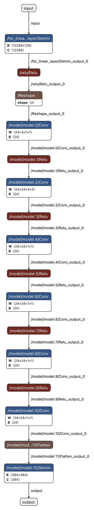
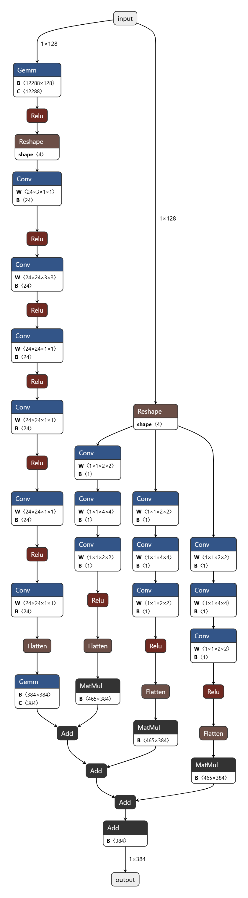

# VNN-COMP 2026 Benchmark: SoundnessBench

This repository provides **SoundnessBench 2026**, a benchmark for the
[VNN-COMP 2026](https://vnn-comp.github.io/#vnncomp2026) competition. It
contains a base SoundnessBench model, a residual SoundnessBench model,
and seed-selected property specifications.

The benchmark is designed to be **simple to parse and easy to run**. It uses
standard ONNX operators that are already supported by most mainstream neural
network verifiers:

- 2D convolutional layers
- ReLU activations
- Add residual connections
- Fully connected / matrix multiplication layers
- Reshaping and flattening between convolutional and linear parts

The residual model is intentionally not a complex architecture: it has
**no ViT blocks, no attention layers, no normalization layers, and no
non-ReLU activations**. The goal is to test verifier soundness on a familiar
Conv/ReLU-style network family rather than to require frontend support for
unusual operators.

## Acknowledgement

Funding support for this research was provided by The MathWorks under DCRG
Project No. 304 under the title "Novel Methodologies and Benchmarks for
assessing the correctness of neural network verifiers".

We thank Antoni Woss at The MathWorks for support and coordination related to
this project.

## Model visualizations

The base model architecture is shown below and in
[`static/model.png`](./static/model.png).

<p align="center">
<a href="./static/model.png">

</a>
</p>

The residual model architecture is shown below and in
[`static/model_residual.png`](./static/model_residual.png).

<p align="center">
<a href="./static/model_residual.png">

</a>
</p>

## Generating specifications

To generate property specifications following the standard VNN-COMP format,
run:

```bash
python generate_properties.py <seed>
```

Per seed, this emits 60 VNN-COMP instances. The generator samples from the
benchmark metadata pools reproducibly for a given seed, writes VNNLIB files
in a uniform format, and shuffles the selected instances. Each generated
`instances.csv` row contains its own ONNX path, VNNLIB path, and timeout.

## Repository layout

- `onnx/`: benchmark ONNX models.
- `metadata/`: seed-generation metadata for the benchmark models.
- `static/`: model architecture visualizations.
- `generate_properties.py`: deterministic seed-based instance generator.

`instances.csv` and `vnnlib/` are generated outputs and are intentionally
ignored by git.

## License

This benchmark is released under the MIT License. See [`LICENSE`](./LICENSE).
